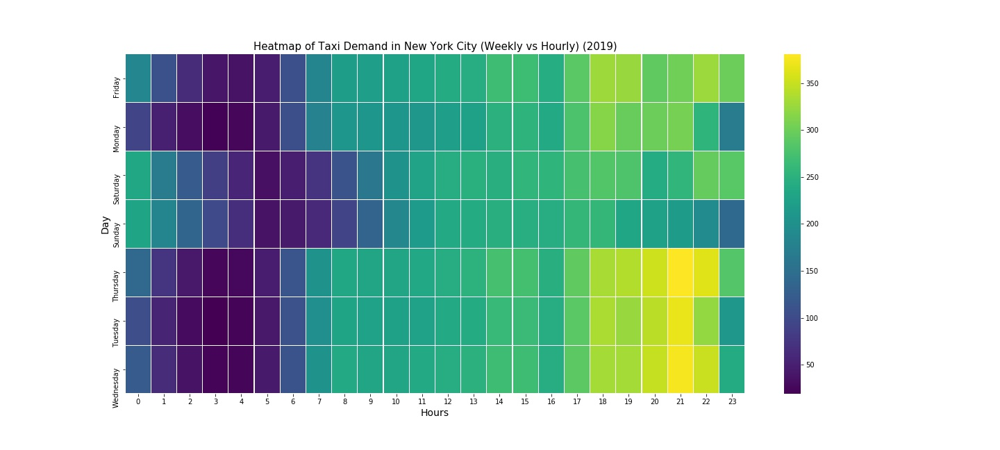

### MODELLING AND ANALYSIS OF DEMAND FOR YELLOW TAXI IN NEW YORK CITY
## Introduction
*The fast-paced and connected world is run by many services and the subtle but vital one is taxi services. The yellow taxi is the heartbeat of economic capital (New York City) and being a part of its culture gives us enough reason to analyse them deeply. The Yellow Taxicab Co. was incorporated in New York on April 4, 1912. Yellow taxi in New York city had roughly around 14000 cabs permitted to operate in the city as per 2014. The taxi takes people from one location to other location within NYC and its demand is influenced by many factors like duration, trip distance, number of passengers, pickup locations, etc. The factors discussed above, and other uncertain factors has become a very important aspect to be discussed and visualized upon. Also, considering external atmospheric conditions as an important factor could lead us to a better predictive model. As a result, it becomes essential to analyse underlying factors and subtle parameters to enhance the existing system to have a better overview on the demand of taxis.*

---

## Sources
- [NYC Yellow Taxi Data](https://www1.nyc.gov/site/tlc/about/tlc-trip-record-data.page)
- The weather data from [DarkSky API](https://darksky.net/dev)
---

## Packages used for EDA
```
import pandas as pd
import numpy as np
import matplotlib.pyplot as plt
import seaborn as sns
from ipywidgets.embed import embed_minimal_html
```
- *Note:The following packages need to be installed:* 
- *pip install seaborn*
- *pip install ipywidgets.embed*

### Data Visualization:
*Exploratory Data Analysis is a process of conducting initial investigations on data set to identify patterns, anomalies, to test hypothesis and to check assumptions with the help of summary statistics and graphical representations. Before removing the outliers from the dataset the distribution of predictors are highly skewed which is evident from the below scatter matrix plot. After removing outliers, the distribution of parameters turns out to be normalized. Making the predictor more normalized gives us the better model.*
*The insights that can be derived from the Scatter Matrix Plot are:*
- *Most of the trips recorded had the passenger count to be in two’s and three’s, this shows that most of the passengers who opted for the yellow taxi tends to travel in two’s and three’s the most.*
- *Most number of trips recorded had passengers travelling less than 30 miles, which makes sense as yellow taxis are commonly used for short trips within NYC.*
- *Similarly average trip duration lies within fifty minutes.*

#### Scatter Matrix Plot (Raw Data):


#### Scatter Matrix Plot (Final Data):


#### Monthly Fluctuation of Demand:

*The line graph shows the monthly fluctuation of demands for the top 5 locations (location with most number of rides in the year 2019) and can be inferred that the demand for yellow taxi was at the peak during the month of March at Madison square. Minimum demand was observed during the month of January and December. This might be due to the impact of winter vacation. Also, the similar downward trend was observed during the summer vacation.*


#### Heat Map (Weekly vs Hourly):

*The following Heat Map compares weekly vs hourly taxi demand and it is evident that the demand was maximum during weekdays. Also, it can be inferred that demand was at its peak from evening to late in night. It is understood that people prefer to take yellow taxi during night time rather than the public transport.*



#### Temperature vs Demand:

*From the Temperature vs Demand plot we can see that there is an increase in trend for demand of taxis when the temperature is very low as well as the temperature is very high. This might be because people may decide their mode of transportation depending upon the atmospheric condition.*


### Model Results:


### Conclusion and Remarks:
- *This project focuses upon studying the behaviour of people who utilize yellow taxi in NYC and predict the demand by considering various factor like atmospheric conditions, etc.* 
- *There were a total of 255 different pickup and drop-off location zones in NYC. Due to computational limitations, we have decided to predict the demand for the top 20 zones were most number of trips were recorded.*
- *For these 20 zones, exploratory data analysis was conducted. From the EDA we have identified unique patterns and anomalies in taxi demand with respect to people’s behaviour and atmospheric conditions.*
- *Informed decision were made in choosing, tuning, training and testing the models and the results were interpreted based upon the best model. The model with best accuracy seems to be the Extreme Gradient Boosting (XG Boost).*
- *The XGB Model states that the factors Temperature, Wind Speed, Hour, Day and Pickup Location are the most significant factors in predicting the demand. Therefore, it is critical for taxi companies to consider these factors in allocating cabs for various locations in NYC.*
---
